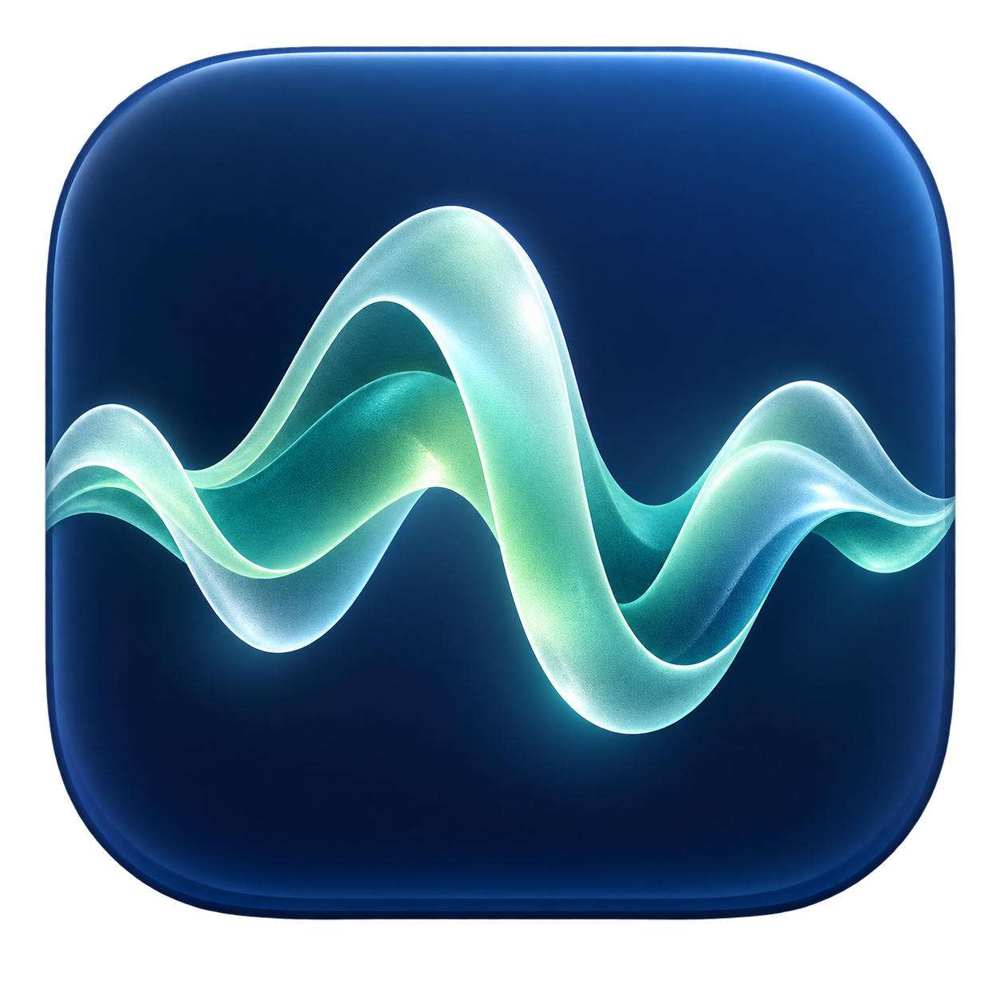

<p align="center"></p>

# Ambient Sounds

A macOS menu bar app for playing and mixing background audio. Use built-in macOS sounds or your own audio files, save five sound shortcuts, and control Spotify or Apple Music from the same panel.

Includes adjustable audio layers, seamless loops, vinyl crackle, and sleep timers. Built with SwiftUI for macOS 26 and later.

## Features

- **16 system sounds:** Balanced Noise, Bright Noise, Dark Noise, Ocean, Rain, Stream, Night, Fire, Babble, Steam, Airplane, Boat, Bus, Train, Rain on Roof, and Quiet Night. Availability depends on macOS and downloaded system assets.
- **Five quick shortcuts:** right-click the menu bar icon for your five saved primary sounds and **Quit**. Selecting a different sound starts it; selecting the playing sound pauses it.
- **Personal sound library:** import local audio, assign an SF Symbol, and organize sounds into folders. Imported files are copied into Application Support.
- **Layered playback:** blend a second custom sound with a relative volume control. Master volume controls the background layers together.
- **Smooth loops:** equal-power crossfades over the final 30 seconds, shortened automatically for short clips. Secondary layers use up to ten minutes of audio.
- **Automatic level matching:** custom sounds are analyzed and normalized to fit alongside system sounds.
- **Vinyl texture:** add a needle-drop effect and continuous crackle that follows the music level.
- **Music controls:** track information, artwork, play/pause, previous/next, seeking, and volume for Spotify and Apple Music, with a system media fallback where available. Click the cover artwork to open Spotify or Apple Music.
- **Sleep timers:** 15, 30, 45, 60, 90, or 120 minutes. Timer completion stops background layers and supported music playback.
- **System synchronization:** built-in sound selection and level stay in sync with macOS Background Sounds.
- **English interface** with a custom app icon.

## Requirements

- macOS 26 or later.
- Xcode with Swift 6.2 or later to build from source.
- Spotify or Apple Music is optional. macOS may request Automation permission for music controls.

## Download

Download the Apple silicon build from [Releases](https://github.com/burakhantd/advanced-background-noise/releases/latest). macOS 26 or later is required.

## Build and run

```sh
./scripts/build-app.sh
open "build/Ambient Sounds.app"
```

The build script creates an ad-hoc signed app for your Mac's architecture. It is not Developer ID signed or notarized. For a locally trusted installation, build from source.

```sh
swift test --disable-sandbox
```

Left-click the menu bar icon to open the controls. Right-click it to access the five primary shortcuts and Quit. To change a shortcut, right-click its button inside the main panel. Use the gear button to manage imported sounds and folders.

## Implementation notes

Apple does not provide a public API for controlling Background Sounds. This project dynamically loads the private HearingUtilities framework; music integration also uses MediaRemote and Apple Events. macOS updates can change these interfaces. This app is not suitable for Mac App Store distribution.

The source does not include personal audio libraries, user preferences, credentials, or machine-specific paths. Custom sound names and file locations remain on the local Mac. Music artwork may be fetched from the URL supplied by the media app.

## Developer

[burakhan.studio](https://burakhan.studio)

## License

[MIT](LICENSE). Contributions are welcome.
