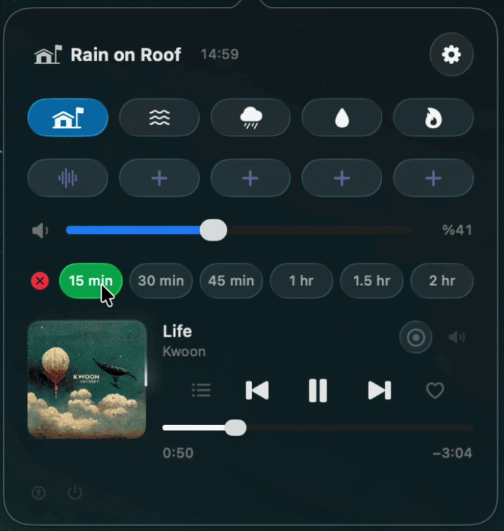

# Ambient Sounds

<div align="center">

**A quieter corner of your Mac.**

A small macOS menu bar companion for mixing background sound, music and vinyl texture without leaving your current work.

<p>
  
  
  
</p>

</div>

<p align="center">
  
</p>

<p align="center"><sub>Choose a texture, shape the mix, set a timer and let the room settle.</sub></p>

<table>
  <tr>
    <td align="center" width="33%"><br>🌧️<br><b>Background layers</b><br><sub>System sounds, custom audio and a second layer with independent balance.</sub><br><br></td>
    <td align="center" width="33%"><br>🎵<br><b>Music in context</b><br><sub>Spotify and Apple Music controls, artwork, repeat, shuffle and Up Next.</sub><br><br></td>
    <td align="center" width="33%"><br>⏳<br><b>Gentle stopping</b><br><sub>Color-coded sleep presets with persistent state and a soft tactile response.</sub><br><br></td>
  </tr>
</table>

## What it does

Ambient Sounds lives in the menu bar and keeps the useful controls close:

- **16 system soundscapes** — Balanced, Bright and Dark Noise, Ocean, Rain, Stream, Night, Fire, Babble, Steam, Airplane, Boat, Bus, Train, Rain on Roof and Quiet Night.
- **Five primary shortcuts** — right-click the menu bar icon to jump between saved sounds, pause the active sound or quit.
- **Custom sound library** — import local audio, keep a copy in Application Support, choose an SF Symbol and organize sounds into folders.
- **Layered playback** — blend a second custom sound with relative volume while the master control keeps the whole mix coherent.
- **Smooth looping** — equal-power crossfades use the last 30 seconds when possible and adapt automatically to shorter clips.
- **Level matching** — imported audio is analyzed and normalized so a custom track sits naturally beside a system sound.
- **Vinyl texture** — add a needle-drop and continuous crackle that follows the current music level.

## The latest UI pass

The current working-tree changes focus on making the panel feel more alive while keeping it calm and readable.

### Timers that explain themselves

Each sleep preset now has its own semantic color, from fresh green at 15 minutes through warm amber and coral to deep red at 2 hours. Selecting a timer uses a short damped bounce and glow, so the active choice is easy to spot without adding another label-heavy status row.

Timer state is also persisted and restored when the panel refreshes. When the timer completes, background layers, vinyl texture and supported music playback stop together.

### Music controls with more room to play

- Album artwork is loaded for Apple Music, cached locally and refreshed when it becomes available.
- Spotify and Apple Music expose play/pause, previous/next, seeking, volume and track information in one compact surface.
- The two side slots are configurable: **Repeat**, **Shuffle**, **Favorite / Liked** or **Up Next / Queue**.
- Up Next expands inline with artwork, artist, duration and an accessible fallback when the queue cannot be read.
- Clicking the cover artwork opens the active music app.

### A friendlier custom library

The custom sound manager now gives each imported sound a clearer identity: a larger icon target, human-readable symbol names, folder assignment, duration and a marquee treatment for long track names. The second-layer balance control stays with the main playback surface, where it is useful while listening.

### A panel that feels intentional

The menu panel uses a compact 360-point layout, stays anchored below the menu bar across screens, and introduces a restrained staggered wave/bounce when opened. Controls retain native SwiftUI behavior and the visual treatment leaves room for reduced-motion and accessibility support.

## Music and sleep controls

The main panel brings the whole listening session together:

| Control | Behavior |
| --- | --- |
| Background sound | Select and play a system or custom sound; selecting the active sound toggles pause |
| Second layer | Start a custom layer and tune it relative to the master volume |
| Master volume | Changes the complete background mix |
| Vinyl | Adds needle-drop feedback and level-following crackle to music |
| Sleep timer | 15, 30, 45, 60, 90 or 120 minutes, with coordinated stop behavior |
| Media | Spotify or Apple Music playback, artwork, position and volume |
| Queue slot | Reveals the upcoming track list inline when supported |

## Requirements

- macOS 26 or later.
- Xcode with Swift 6.2 or later to build from source.
- Spotify or Apple Music is optional. macOS may request Automation or Accessibility permission for music controls and queue access.

## Download

Download the Apple silicon build from [Releases](https://github.com/burakhantd/advanced-background-noise/releases/latest). macOS 26 or later is required.

## Build and run

```sh
./scripts/build-app.sh
open "build/Ambient Sounds.app"
```

The build script creates an ad-hoc signed app for your Mac's architecture. It is not Developer ID signed or notarized. For a locally trusted installation, build from source.

Run the test suite with:

```sh
swift test --disable-sandbox
```

Left-click the menu bar icon to open the controls. Right-click it to access the five primary shortcuts and Quit. To change a shortcut, right-click its button inside the main panel. Use the gear button to manage imported sounds and folders.

## Implementation notes

Apple does not provide a public API for controlling Background Sounds. This project dynamically loads the private HearingUtilities framework; music integration also uses MediaRemote and Apple Events. macOS updates can change these interfaces. This app is not suitable for Mac App Store distribution.

The source does not include personal audio libraries, user preferences, credentials or machine-specific paths. Custom sound names and file locations remain on the local Mac. Music artwork may be fetched from the URL supplied by the media app.

## Developer

[burakhan.studio](https://burakhan.studio)

## License

[MIT](LICENSE). Contributions are welcome.
